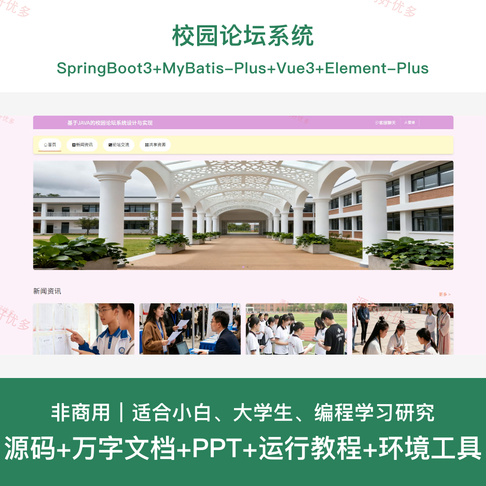
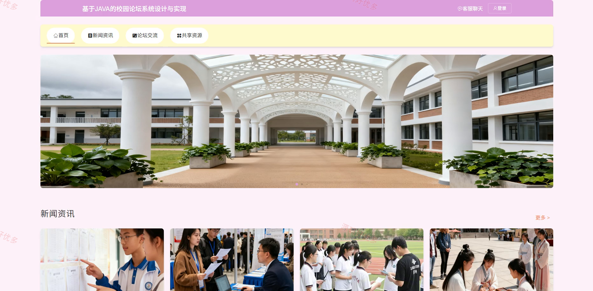
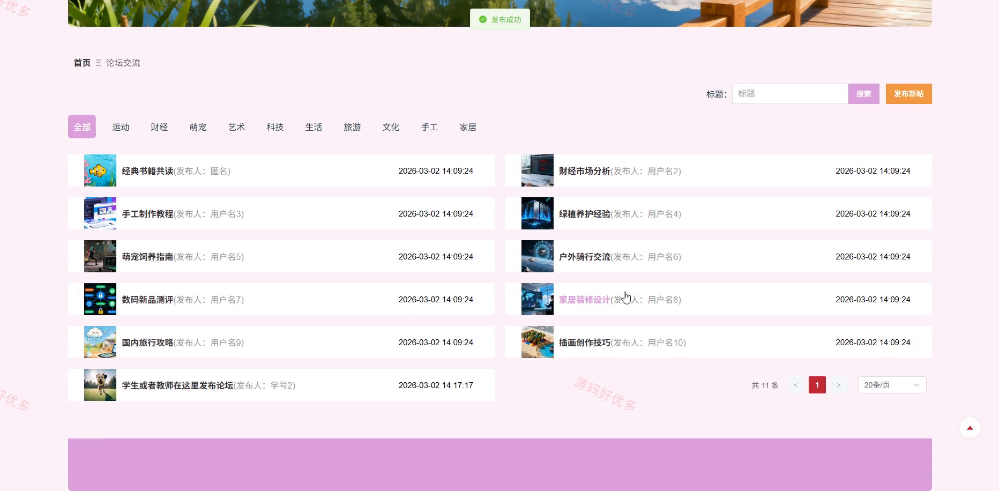
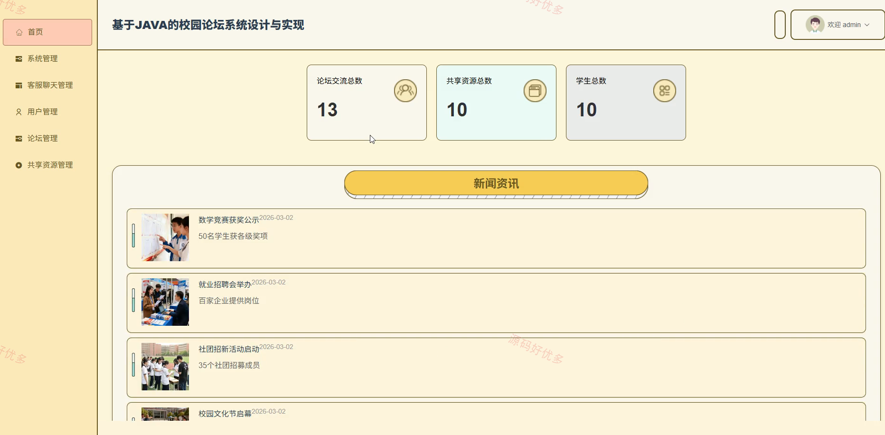
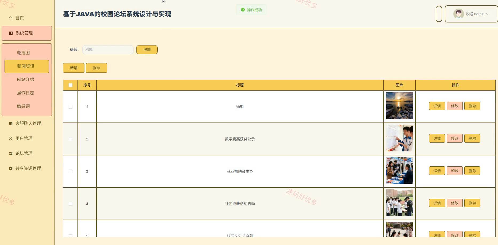
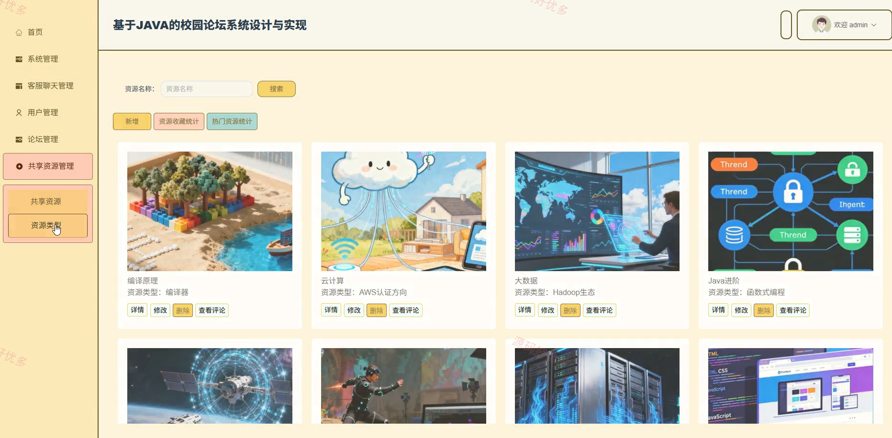
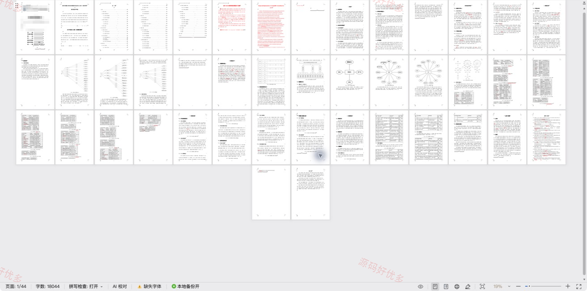

## 源码问题查看主页咨询

### 一、关键词
校园论坛系统、校园论坛、校园论坛信息管理、校园论坛后台管理

### 二、作品包含
源码+数据库+万字设计文档+PPT+全套环境和工具资源+本地部署教程

### 三、项目技术
前端技术： Html、Css、Js、Vue3.5、Element-Plus
后端技术：Java、SpringBoot3.3.0、MyBatis-Plus

### 四、运行环境（以下版本亲测，其他版本兼容性请自行测试）
开发工具：IDEA/eclipse + VSCODE

数据库：MySQL8.0+（共19张表）

数据库管理工具：Navicat10以上版本

环境配置软件： JDK17 + Maven3.6.3

前端Nodejs：16+

浏览器：谷歌浏览器

### 五、项目介绍
项目编号：springbootA691D

校园论坛系统面向教师、学生、管理员，提供共享资源管理、我的收藏查看、新闻资讯查看、论坛交流管理、论坛交流查看评论、共享资源查看、共享资源查看评论等功能，实现各角色在系统中的实际业务协作。

角色：管理员、教师、学生

管理员功能：后台登录、系统管理、客服聊天管理、用户管理、论坛管理、共享资源管理。

教师功能：前后台登录与账号注册、新闻资讯查看、论坛帖子发布与管理、论坛评论查看与评价、共享资源发布与管理、共享资源查看与下载、共享资源点赞与收藏、共享资源评论与评价。

学生功能：登录注册与个人中心维护、新闻资讯查看、论坛帖子发布与管理、论坛评论查看与评价、共享资源查看与下载、共享资源评论点赞与收藏、我的发布查看与评价、我的收藏查看。

### 六、运行截图

